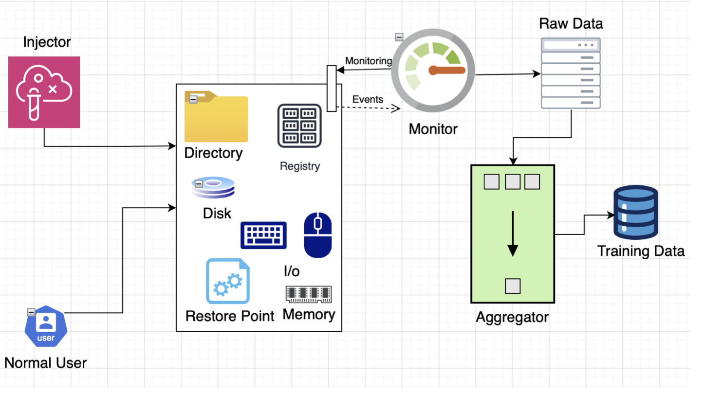
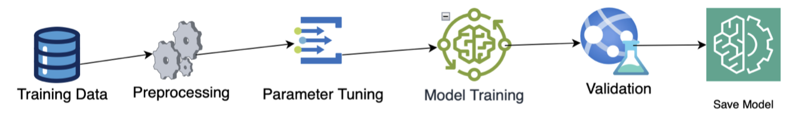
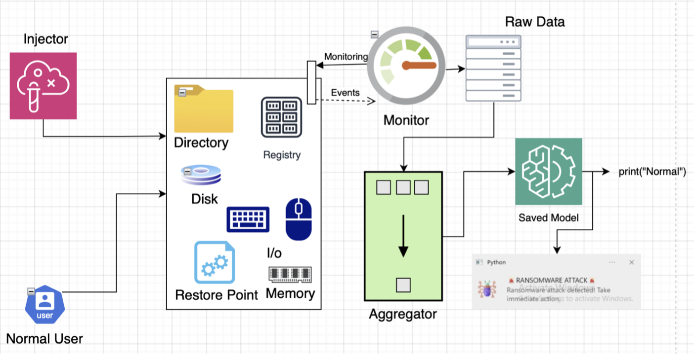

<h1 style="text-align: center; color: #3a86ff;">Real-time Ransomware Detection on a File System</h1>

## ⚠️ Disclaimer  

**WARNING:** This project performs critical operations such as:  
- File encryption  
- Disabling system protections like Windows Firewall, Defender, and Task Manager  

**Use with Extreme Caution:**  
- Run this project only in a **sandboxed environment** (e.g., a virtual machine or isolated test environment) where no sensitive data is stored.  
- Never execute this code on a production system or any machine containing valuable or personal data.

### Decryption Instructions  

To help mitigate potential data loss, this project provides a decryption mechanism.  
Here's how it works:  

1. **Injection Mode:**  
   When the injector is run, you will be prompted with two options:  
   - **Inject:** Encrypts all files in the selected directory.  
   - **Decrypt:** Unlocks previously encrypted files.  

2. **To Decrypt Files:**  
   - Re-run the injector and select the **Decrypt** option.  

By using this project, you acknowledge that you are responsible for your actions and agree to exercise proper caution.  The author is not liable for any data loss or system damage resulting from misuse.  

<h2 style="text-align: center; color: #3a86ff;"> Problem to be Solved </h2>

Ransomware poses a significant threat to organizations and individuals by encrypting critical files and demanding ransom payments for decryption keys. Traditional antivirus solutions often fail to detect ransomware in real-time, leading to severe data loss and financial damage. This project aims to develop a real-time ransomware detection system for monitoring file system activities, detecting anomalies indicative of ransomware, and preventing damage before it occurs.

The solution involves designing and integrating a system that continuously monitors file system operations, analyzes behavioral patterns, and uses machine learning to differentiate between normal and malicious activities. By leveraging real-time anomaly detection, this project addresses the critical need for proactive ransomware protection.

<h2 style="text-align: center; color: #3a86ff;">How the Monitor is Designed and Why? </h2>

The monitor is designed to collect real-time metrics from the file system, system resources, system security, access patterns, disk, and user inputs. It runs every 1 second, in an infinite loop (until closed), to keep an eye on events happening in the directory, and in specific parts of the system such as the registry. The choice of 1 second is made based on the fact that monitoring files continuously in short duration can be resource consuming and can make the system slow where it runs, while also it is not kept high to make sure the anomaly (if any), is detected very quickly, without causing too much harm.

The monitor captures the following file system events:
    - ***File Creation:*** Detection of new files being created.
    - ***File Modification:*** Changes made to existing files, changes such as content, permission and movement of files.
    - ***File Deletion:*** Files being deleted from the system.
    - ***File Renaming:*** Files being renamed.
    - ***File Encryption:*** Specific detection of files being encrypted (e.g., with ENCRYPTED extensions).

For every logged event, we create a record in csv after computing these features:

**File System Metrics:**
    - *Timestamp:* The time when an event occurred on file.
    - *Operation Type:* Type of event (created, modified, deleted, renamed, or encrypted).
    - *File Size:* Size of the affected file in KBs (normalized using a logarithmic scale).
    - *File Extension:* The extension of the affected file (e.g txt, doc, xls, pdf, png, zip etc).
    - *File Entropy:* Shannon entropy of the file content, indicating randomness (higher entropy suggests encryption).
    - *Sequential Operations:* Number of sequential operations within a short time frame.
    - *Operation Sequence Length:* Length of the recorded sequence of operations.

**System Resource Metrics:**
    - *CPU Usage:* Real-time CPU utilization percentage (normalized to 0–1).
    - *Memory Usage:* Real-time memory utilization percentage (normalized to 0–1).
    - *Disk I/O Read Count:* Change in the number of disk read operations (in KB).
    - *Disk I/O Write Count:* Change in the number of disk write operations (in KB).

**Security Metrics:**
    - *Shadow Copy Count:* Number of system shadow copies available.
    - *Restore Point Count:* Number of system restore points available.
    - *Registry Edits:* Count of registry modifications.

**Security State Flags:**
    - *Firewall Disabled:* Boolean flag indicating whether the firewall is disabled when something is happening in the monitored directory.
    - *Windows Defender Disabled:* Boolean flag indicating whether Windows Defender is disabled when something is happening in the monitored directory.
    - *Task Manager Disabled:* Boolean flag indicating whether Task Manager is disabled during a file event.

**User Input Metrics:**
    - *Key Presses:* Number of keyboard presses during a monitoring period. When event is logged, the number is reset.
    - *Mouse Activity:* Number of mouse movements during a monitoring period.When event is logged, the number is reset.

<h2 style="text-align: center; color: #3a86ff;">Selection of Monitored Indicators </h2>

The indicators were selected based on their relevance to ransomware detection. I did some literature review, and already had an idea how ransomware behaves.

**1. Literature Review**

Research papers and surveys on ransomware behavior and detection using machine learning highlighted key indicators, such as:
    - **Entropy:** High randomness in file content, typical of encryption.
    - **Sequential Operations:** Patterns of mass file access or modification.
    - **Registry Modifications:** Changes in security-related keys, making system calls.
    - **System Security Changes:** Disabling firewalls, antivirus, or recovery mechanisms.
    
These indicators were validated through studies (*[Amjad Alraizza, 2023]*, *[Avinash Singh, 2022]*).

**2. Practical Experience**
During my bachelor's studies, a friend received an email from a gaming site with a Word document attached. Upon opening the document, it created a backdoor to communicate with a command-and-control (C&C) server. Within minutes, all the files on the system were encrypted, and a message appeared demanding payment in Bitcoin to regain access to the files. So typically, too fast operations, within a short time, while security features on the system are disabled are signs of ransomware.

<h2 style="text-align: center; color: #3a86ff;">The process of generating the training set </h2>

The training set was generated by simulating both normal and ransomware-like behaviors. I collected raw_data of **23731** points, by behaving normally (with multiple variations), and anomalously (with multiple variants). Here is table

| Behavior   | Time (minutes) | Total points captured | Strategy |
|------------|----------------|------------------------|----------|
| Normal     | 10             | 0 - 678                | N1       |
| Anomalous  | 1              | 679 - 1327             | I1       |
| Normal     | 10             | 1328 - 1837            | N1       |
| Normal     | 5              | 1838 - 2176            | N1       |
| Normal     | 10             | 2177 - 3599            | N2       |
| Anomalous  | 1              | 3600 - 3817            | I2       |
| Normal     | 10             | 3818 - 6550            | N3       |
| Anomalous  | 1              | 6551 - 6695            | I3       |
| Anomalous  | 1              | 6696 - 6951            | I1       |
| Normal     | 10             | 6952 - 7614            | N1       |
| Anomalous  | 1              | 7615 - 7918            | I2       |
| Normal     | 5              | 7919 - 9660            | N2       |
| Anomalous  | 1              | 9661 - 10242           | I1       |
| Normal     | 1              | 10243 - 10292          | I4       |
| Normal     | 3              | 10293 - 18517          | N5       |
| Normal     | 3              | 18518 - 23731          | N4       |

***N1:*** Regular user activity on the file system, including renaming, deleting, modifying content, and moving files, performed at a normal or slow pace.

***N2:*** User activity on the file system, involving renaming, deleting, modifying content, and moving files, performed at a higher speed with quick succession.

***N3:*** Rapid file system operations, including copying, moving, deleting, renaming, pasting, modifying content, and changing permissions, performed at a much faster pace.

***N4:*** High-speed file system operations with mixed actions (e.g., renaming, deleting, modifying, and moving), performed on various file types in a non-sequential manner.

***N5:*** Extremely fast, close to I1, file system operations involving diverse file types and actions, performed in a highly random and non-sequential pattern.

***I1:*** The best version of ransomware I could produce. It Captures a broad range of malicious activities, mimicking the full spectrum of ransomware behavior, including file operations, folder compression, encryption, and changes to file permissions or timestamps.

***I2:*** Simulates a more restricted anomaly, excluding certain operations like timestamp and permission modifications but still involving bulk actions.

***I3:*** Targets core ransomware actions such as file encryption and renaming to simulate minimal malicious activity.

***I4:*** Injects normal file encryption operations with delay of 2 to 3 seconds, to ensure the system is not overly sensitive and avoids false positives, helping to establish a baseline for normal behavior. Check I4 in the table, it was performed for normal behavior.

This raw data, generated by **Monitor**, is then fed to **Aggregator** that transforms it into structured, labeled datasets suitable for training the anomaly detection model. It cleans, groups, and summarizes the data while associating each time bin with its corresponding behavior label. Here’s how it operates:

- The Aggregator processes raw data collected by the monitor and organizes it into fixed time intervals (3-second bins). 

- It applies labels to each segment based on the predefined ranges of behavior (e.g., normal or anomaly) noted during data collection.

The aggregation is needed, as a single event can not be said to be anomalous. Moreover, it significantly reduces the volume of data while retaining essential features. It is based on time, because the faster operations in short time signify an anomaly.

<h2 style="text-align: center; color: #3a86ff;">Process of Training, Testing, and Comparing Algorithms </h2>

## Training and Testing Process

1. ***Preprocessing:*** The dataset was cleaned, missing values were handled, and features were standardized using a StandardScalar. The dataset was split into training (80%) and testing (20%) sets, maintaining class distribution through stratified sampling.

2. ***Training:*** Before training, the GridSearchCV technique is applied to determine best parameters, then Six individual algorithms (Logistic Regression, Random Forest, SVM, Gradient Boosting, KNN, and Decision Tree) and a Voting Classifier were trained. The Voting Classifier combined predictions from all models for improved robustness.

3. ***Testing:*** Each model was tested on the 20% data, while in training and predictions were evaluated against ground truth labels. I tested the detector as a whole on my system and it seems to work.

| Algorithm          | Accuracy | F1 Measure | Recall | MCC   |
|--------------------|----------|------------|--------|-------|
| **Logistic Regression** | 0.9674   | 0.9664     | 0.9674 | 0.814 |
| **Random Forest**       | 0.986    | 0.9859     | 0.986  | 0.9228|
| **SVM**                 | 0.9721   | 0.9708     | 0.9721 | 0.8399|
| **Gradient Boosting**   | 0.986    | 0.9859     | 0.986  | 0.9228|
| **KNN**                 | 0.9581   | 0.9557     | 0.9581 | 0.7541|
| **Decision Tree**       | 0.9535   | 0.9544     | 0.9535 | 0.7575|
| **Voting Classifier** | 0.9907 | 0.9905 | 0.9907 | 0.9486 |

<h2 style="text-align: center; color: #3a86ff;">Motivation Behind choice of Algorithms, the metrics for benchmarking, and parameters tuning </h2>

Because the dataset is binary, labelled so I chose Supervised algorithms. Compared them based on accuracy, F1, Recall and MCC. Ultimately, I chose the one with highest MCC because my dataset is unbalanced (*89.95% normal*, *10.05% anomaly*) so accuracy, F1 and Recall could not be relied upon and MCC provides a balanced evaluation. You will notice, Voting Classifier performs well, and I saved it as the best model, even knowing that voting is more time consuming than individual, but at this stage I assume to have fair enough resources. The parameter tuning was done using GridSearchCV to find the best parameters. Based on findings, adjusted the parameters. The code to find best params is also in model.py, and best parameters are written to `best_params_report.txt`.

<h2 style="text-align: center; color: #3a86ff;">Integration of Monitor and Detector to create runtime anomaly </h2>

The integration of monitor and detector is actually a complete pipeline, where model training is skipped and saved model is used. The desktop_app.py is responsible for this integration. The monitor continuously monitors the system (Directory, Registry, Memory, CPU, I/O etc), then it generates raw data, which is then fed to the aggregator based on the same rules applied to prepare the training set. The aggregated data is then pre-processed, scaled and then queried to saved_model. The model either predicts normal or anomaly for the aggregated data.

<h2 style="text-align: center; color: #3a86ff;">How to execute/run the code? </h2>

***- Please run the code on Virtual Environment where you don’t have sensitive data. Although, you decide to select the directory when you run the injector, but still it needs to be done carefully.***

- Clone the repo or dowload code and place everything in a directory.

- At root, you will see all files i.e `monitor.py`, `injector.py`, `model.py`, `aggregator.py`, `desktop_app.py` and `enablers.py` along with `best_model.pkl`, `scaler.pkl`, raw and aggregated datasets and best params text file.

- Run `desktop_app.py` first, behave normally in directory you selected when you run desktop_app, it should print **normal** labels. If you run injector.py (I1, I2 or I3 variants), it should predict **anomaly** label and alert will be shown.

<h2 style="text-align: center; color: #3a86ff;">References </h2>

[Amjad Alraizza, 2023]. [Ransomware Detection Using Machine Learning: A Survey
](https://www.mdpi.com/2504-2289/7/3/143)[Avinash Singh, 2022]. [Ransomware Detection using Process Memory](https://arxiv.org/abs/2203.16871)